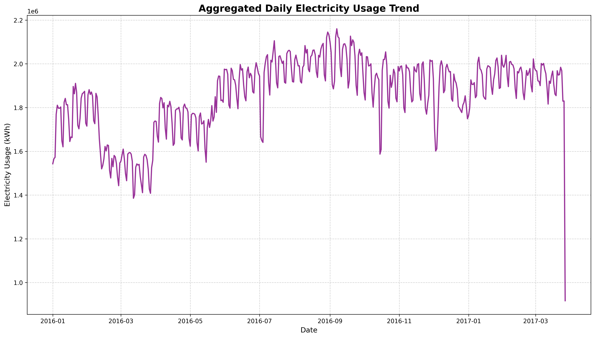
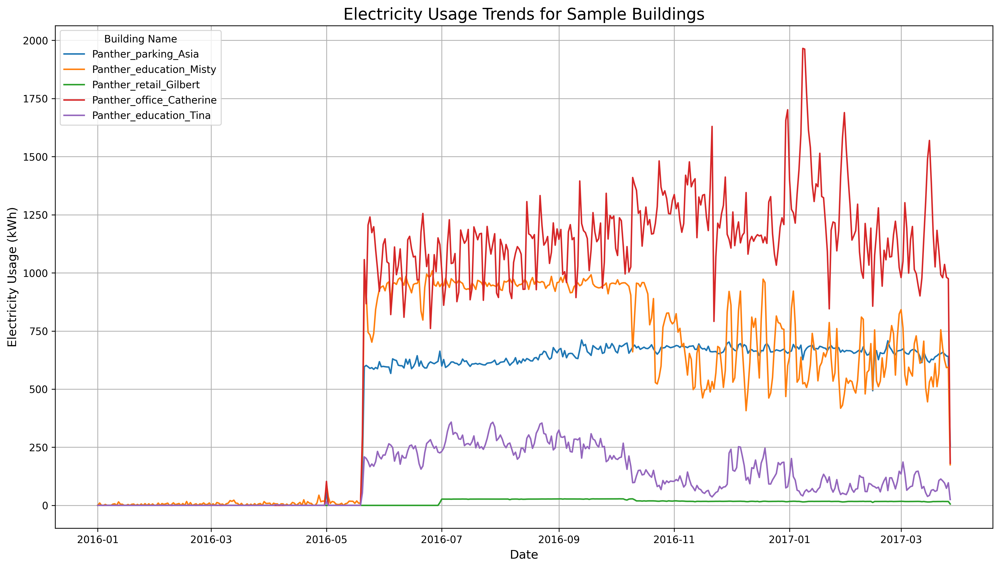
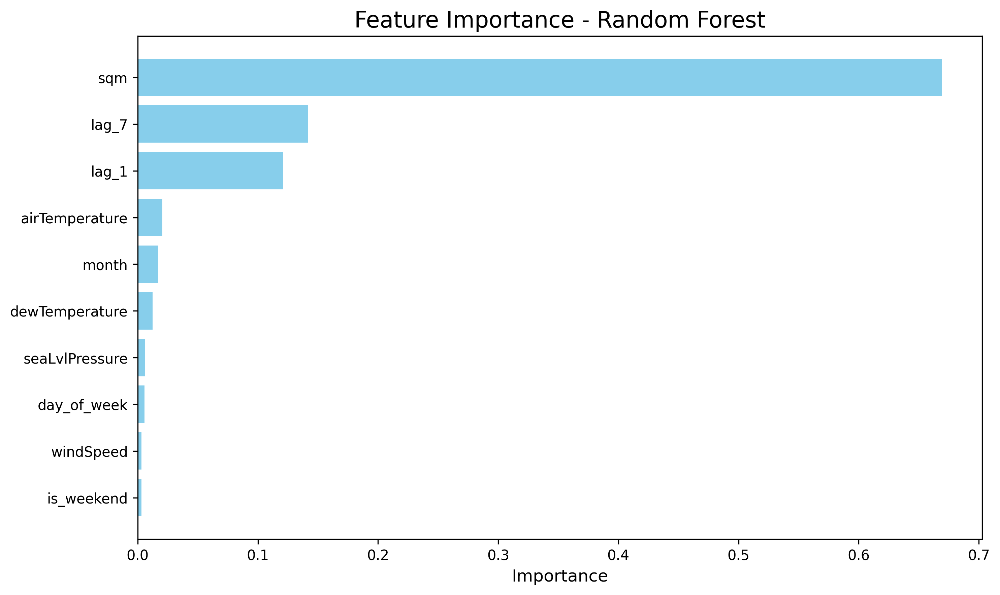

# Energy Consumption Forecasting

*A data-driven approach to forecast and optimize electricity consumption across non-residential buildings using advanced machine learning models.*

## 1. Business Context

Efficient energy management has become a growing challenge for organizations, utilities, and city planners due to rising energy costs, increasing demand, and sustainability mandates. Non-residential buildings consume a significant share of total electricity, often operating inefficiently during non-peak hours or with misallocated resources.

This project addresses these inefficiencies by leveraging data analytics and machine learning to predict energy usage trends, identify waste, and enable strategic planning for future energy demands.  
The ultimate goal is to provide actionable insights that support:
- Reduced operational costs  
- Improved forecasting and planning  
- Enhanced sustainability efforts  

## 2. Problem Definition

**Business Problem:**  
Organizations face challenges in monitoring and optimizing energy consumption due to variability in usage patterns across time, weather conditions, and building characteristics.

**Objective:**  
Develop a predictive model to forecast daily electricity consumption for non-residential buildings and identify inefficiencies to support cost reduction and sustainability goals.

**Problem Type:** Regression  
**Target Variable:** Electricity consumption (kWh)  
**Key Inputs:** Time, temperature, humidity, wind speed, building metadata  

**Dataset:**  
Subset of the **Building Data Genome Project 2**, containing hourly electricity readings for multiple North American buildings between **2016–2017**.

📊 **Dataset Source:** [Building Data Genome Project 2 on Kaggle](https://www.kaggle.com/datasets/claytonmiller/buildingdatagenomeproject2)  

## 3. Data Understanding and Preparation

### Dataset Overview
- **Scope:** Hourly electricity data (2016–2017) converted to daily for modeling  
- **Coverage:** Buildings across North America and Europe (Europe excluded for data quality)  
- **Granularity:** Hourly → aggregated to daily intervals  
- **Primary Variables:**  
  - Timestamp (datetime)  
  - Electricity consumption (kWh)  
  - Weather conditions (temperature, wind speed, pressure)  
  - Building metadata (type, area, location)  

### Data Cleaning and Preprocessing
- Removed redundant metadata columns  
- Converted timestamps and merged datasets by datetime  
- Imputed missing values (zeros where continuity was needed)  
- Handled outliers using IQR method  
- Feature engineered lag variables (1-day, 7-day)  
- Added time-based variables (month, weekend flag)  

### Key Insights from EDA
- Electricity usage showed strong **seasonality** (higher in colder months)  
- **Daily aggregation** improved scalability and reduced "zero gap" inconsistencies  
- **Building size** and **temperature** were major drivers of electricity use  

#### Electricity Usage Trends

The aggregated daily consumption across all buildings reveals clear temporal patterns and seasonality:

*Figure 1: Daily electricity consumption trends showing seasonal variations and weekly patterns*

Individual building analysis shows diverse consumption profiles based on building type and size:

*Figure 2: Electricity usage patterns for sample buildings, demonstrating variability across different building types*

## 4. Approach and Methodology

### 4.1 Model Selection
Multiple models were evaluated:
- **SARIMA:** High error rates, unsuitable for large-scale multivariate data  
- **Gradient Boosting Regressor:** Good performance but less interpretable  
- **Neural Networks:** Achieved R² = 0.917 but required extensive tuning  
- **Random Forest Regressor:** Chosen as the final model for its robustness, interpretability, and ability to capture non-linear relationships.

### 4.2 Model Rationale
- Handles complex feature interactions between weather and time variables  
- Provides **feature importance** for interpretability  
- Resilient to outliers and missing data  
- Scalable for multi-building datasets  

### 4.3 Model Training and Validation
- **Cross-validation:** 5 folds  
- **Metrics:** RMSE, MAE, R²  
- **Performance:**  
  - RMSE: 386.39  
  - MAE: 167.10  
  - R²: 0.96  
  - Mean RMSE (CV): 700.91 ± 118.51  

## 5. Results and Insights

### Model Evaluation
- The Random Forest model accurately captured electricity consumption trends.  
- Predictions aligned closely with actual usage, even for buildings with fluctuating patterns.  

#### Feature Importance Analysis

The model identified building characteristics and time-series patterns as key predictors:

*Figure 3: Feature importance rankings showing building size (sqm) as the dominant predictor (67%), followed by lag features capturing temporal dependencies*

**Key Findings:**
- **Building size (sqm)**: strongest predictor (~67% importance)
- **Lag variables (Lag_1, Lag_7)**: captured temporal dependencies (~26% combined)
- **Temperature & Wind speed**: influenced seasonal energy variations (~4%)
- **Temporal variables (month, is_weekend)**: explained recurring usage cycles (~3%)

### Business Impact
- **Forecast Accuracy:** 96% explanatory power in consumption trends  
- **Operational Efficiency:** Identify off-hour wastage for cost optimization  
- **Sustainability:** Quantify the environmental impact of improved energy efficiency  
- **Planning Enablement:** Predict seasonal peaks to aid budgeting and resource planning  

## 6. Getting Started

For detailed installation instructions, setup guide, and step-by-step pipeline execution, please refer to:

**[Getting Started Guide](docs/getting-started.rst)**